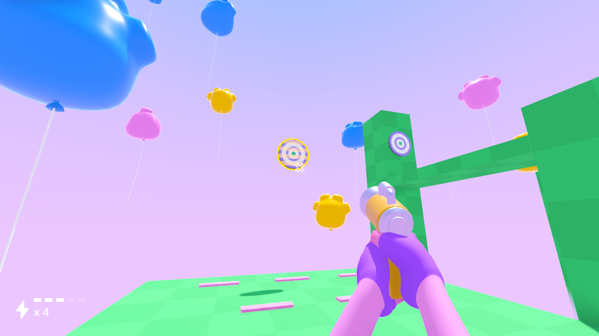

<h1 align="center">

 
Fps Arms</h1>

An open-source arm rig for first-person shooter games. Compatible with Godot game engine version 4.

## Preview

## Features

| Feature  | Description |
| ------------- | ------------- |
| Color customization | Set skin color for arms, nails and gloves. |
| Animations | Default idle, walk, shoot and reload animations. |
| Focus Manager | Highlight targeted objects. |
| Ammo Manager | Configure different weapons with different ammunition settings. |
| Hit Zone | Turns any `Area3D` into a targetable object with focus, blur and hit signal. |
| Pickup | Ammo and health pickup. |

## Credits

[Sound effects by Kenney](https://kenney.nl/assets/category:Audio)
